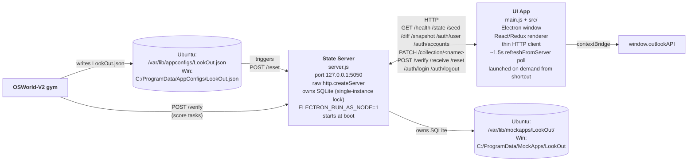

---
tags:
  - lookout-desktop
  - index
  - about
  - mock-app
  - osworld-v2
  - electron
---

# LookOut — Codebase Map

LookOut is a mock Outlook / email client (Electron + React/Redux + TypeScript) packaged to run inside **OSWorld-V2 VM snapshots** (Ubuntu + Windows) with no runtime to pre-install. It is used by AI-agent trainers to author and run evaluation tasks against a realistic email-client surface. Companion app to **SlackIt** (`../slack`, port `5070`); both follow the same two-process pattern — see `docs/CROSS_GYM_ALIGNMENT.md`.

**Repo:** `turing-rlgym/lookout-desktop` | **Manifest:** `manifest.json` | **State Server:** `http://127.0.0.1:5050` | **OSWorld contract:** `verification_endpoint = /verify`, `health = /health`, `reset = POST /reset`, `startup_wait_ms = 4000`.

## Quick Reference

| Need | Go To |
|------|-------|
| Understand the two-process split (State Server vs UI) | [[lookout-desktop/About/Architecture]] |
| HTTP API contract (`/health /state /seed /diff /collection/* /verify /receive /reset /auth/* /snapshot`) | [[lookout-desktop/About/Http-Api]] |
| Build, package, install on VM (`linux-unpacked` / `win-unpacked`) | [[lookout-desktop/About/Build-Install]] |
| Trainer installers — single-file `.exe` / `.dmg` / `.AppImage`, no admin | [[lookout-desktop/About/Trainer-Installers]] |
| Redux store — slices, thunks, selectors, persistence middleware | [[lookout-desktop/About/Redux-Store]] |
| Pre-seed, preconfig, per-task seeding via `LookOut.json` → `POST /reset` | [[lookout-desktop/About/Seeding]] |
| `/verify` endpoint + assertion schema | [[lookout-desktop/About/Verification]] |
| Fixed OS paths + `MOCKAPP_STORE_DIR` / `MOCKAPP_CONFIG_PATH` overrides | [[lookout-desktop/About/Paths]] |
| UI components, views, pop-out windows, polling strategy | [[lookout-desktop/About/Ui-Surface]] |
| `manifest.json` task registry + `scripts/scenarios_registry.py` | [[lookout-desktop/About/Tasks-Manifest]] |
| SQLite schema, seed collections, generated pools | [[lookout-desktop/About/Data-Layer]] |

## File Map

```
lookout-desktop/
├── server.js                     # State Server — raw http.createServer, port 5050, owns SQLite
├── main.js                       # Electron main: window, IPC, spawns server in trainer mode
├── preload.js                    # contextBridge → window.outlookAPI
├── index.html / vite.config.ts   # Vite entry for the renderer; @ alias → ./src
├── manifest.json                 # OSWorld-V2 mock-app contract (verify_endpoint, health, reset)
├── electron-builder.trainer.json # trainer installer config (per-user, no admin)
├── install.sh / install.ps1      # VM installers (systemd / scheduled task); additive only
│
├── src/                          # React/Redux renderer (TypeScript)
│   ├── App.tsx                   # root: loader + ~1.5s poll + pop-out window router
│   ├── main.tsx                  # React root + store provider
│   ├── layouts/                  # OutlookLayout shell (ribbon, sidebar, content, status bar)
│   ├── pages/                    # Login, Mail (2)
│   ├── views/                    # MailView, CalendarView, PeopleView, TodoView (4)
│   ├── components/               # 62 .tsx files: mail/, calendar/, contacts/, common/
│   ├── windows/                  # pop-out NewComposeWindow, NewEventWindow, …
│   ├── store/                    # Redux Toolkit — 13 slices, thunks/, 3 selectors modules
│   │   └── middleware/persistenceMiddleware.ts
│   ├── api/                      # serverClient (HTTP), mockAPI (fallback)
│   ├── types/, utils/, lib/, hooks/, assets/
│   └── main/                     # shared between server.js + main.js
│       ├── paths.js              # OS-aware fixed paths (Ubuntu/Win/dev overrides)
│       ├── folder-resolve.js     # defaultInboxFolderId, resolveCollectionFolderId
│       ├── services/             # sqlite.service, storage.service, schema.sql
│       ├── preconfig/            # config-reader, -validator, -defaults, seeder, data-generator, pools
│       ├── init-storage.js       # boot: open SQLite, apply seed or preconfig
│       ├── verification-server.js# /verify endpoint + assertion engine
│       └── ipc/                  # attachments.handlers, storage.handlers
│
├── data/
│   ├── seed/                     # 9 JSON baselines: accounts, calendars, categories,
│   │                             #   contact-groups, contacts, emails, events, folders
│   ├── *.json                    # generated pools (calendar/contact/email-pool.json)
│   └── schema-version.json
│
├── renderer/                     # legacy vanilla HTML/JS/CSS prototype — reference only
├── outlook-assets/               # static SVGs (calendar/mail/people/todo/...)
├── assets/   public/             # icon + image fallbacks
├── scripts/                      # generate-pool-data.js, scenarios_registry.py, threading fix
└── docs/                         # INSTALL-TRAINERS, PACKAGING*, CROSS_GYM_ALIGNMENT,
                                  #   QA_STAGED_UPDATES, data_architecture, schema.dbml
```

## Architecture at a Glance



State flow: UI dispatch → slice reducer → `persistenceMiddleware` → `PATCH /collection/<name>` → SQLite. Server → UI sync is via the 1.5s poll plus targeted IPC events for cross-window events (email sent, event created/deleted).

## Key Numbers

| Metric | Count |
|--------|-------|
| State Server routes (raw `http.createServer` handlers in `server.js`) | 13+ (`/health /state /seed /diff /snapshot /collection/* /verify /receive /reset /auth/user /auth/accounts /auth/login /auth/logout`) |
| Redux slices | 13 |
| Redux selectors modules | 3 |
| React component files (`src/components/**/*.tsx`) | 62 |
| Views | 4 (Mail, Calendar, People, Todo) |
| Pages | 2 (Login, Mail) |
| Pop-out windows | 3 (NewCompose, NewEvent, …) |
| Main-process JS files (`src/main/**/*.js`) | 19 |
| Seed collections (`data/seed/`) | 9 |
| Tasks defined in `manifest.json` | 23 |
| Test accounts | 2 (`john.doe@example.com`, `sarah.johnson@company.com`) |
| Default HTTP port | 5050 (bound `127.0.0.1`, no auto-increment) |
| UI poll cadence | ~1.5s |
| OSWorld `startup_wait_ms` | 4000 |

## Top 5 Files to Read First

1. `server.js` — the headless State Server; understand the HTTP API and SQLite ownership
2. `src/main/paths.js` — single source of truth for OS-specific store + config paths
3. `src/App.tsx` — UI root: loader gate, 1.5s server poll, pop-out window routing
4. `src/store/middleware/persistenceMiddleware.ts` — Redux → server sync (gated off in pop-out windows)
5. `src/main/verification-server.js` — `/verify` scoring summary + assertion-based verifier

## Notable Patterns

- **Two-process split**: headless State Server owns state; UI is a thin HTTP client. Crashing the UI never loses state.
- **`asar: false` is required** in `electron-builder` — `resources/app/server.js` must be a real file so `ELECTRON_RUN_AS_NODE=1` can execute it.
- **Per-task seeding is config-driven, not code-driven**: gym writes the OS-specific `LookOut.json` → calls `POST /reset` → server re-seeds.
- **No auto-increment on port 5050** — the server's port collision is its single-instance lock; the server logs and exits if the port is taken.
- **Persistence middleware is gated off in pop-out windows** to prevent stale-snapshot clobbers.
- **Companion to SlackIt** (`../slack`, port `5070`) — both follow the same two-process pattern; cross-gym alignment doc: `docs/CROSS_GYM_ALIGNMENT.md`.
- **Trainers** can run LookOut on their own laptop via `dist:trainer*` → `.exe` / `.dmg` / `.AppImage` (no admin, no Node, no DB); see `docs/INSTALL-TRAINERS.md`.

## Project Rules

See `CLAUDE.md` (alias `AGENTS.md`) in the repo root. 17 rules covering: think-before-coding, simplicity first, surgical changes, goal-driven execution, token budgets are not advisory, surface conflicts, read before you write, tests encode intent, checkpoint after each step, match conventions, fail loud, no co-author on commits, live testing via Chrome CDP with the `turing` profile, Obsidian vault context (this file lives at `lookout-desktop/About.md`), micro commits, no force-adding gitignored files.