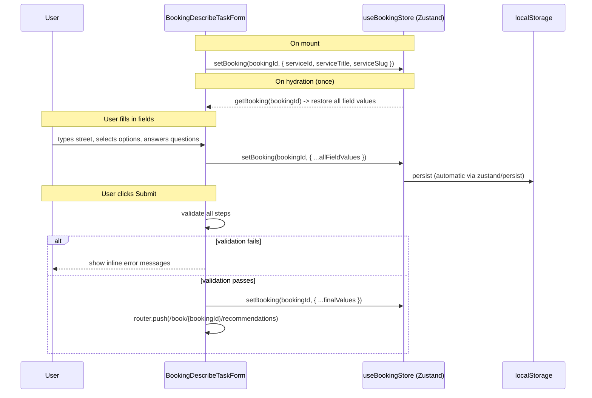
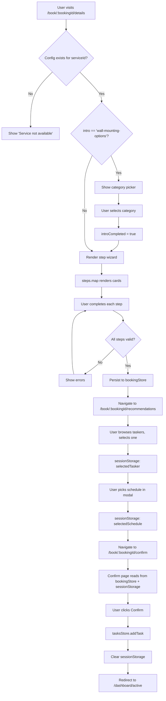

# Config-Driven Booking Wizard

> How the TaskRabbit clone renders per-service booking forms from a single
> declarative config file, without writing any new React components.

## Architecture Overview

```
src/config/booking.js            <-- declarative config (the "what")
        |
        v
BookingDescribeTaskForm.tsx      <-- generic renderer  (the "how")
        |
        |  reads config[serviceId]
        |  iterates config.steps[]
        |  renders matching section for each step ID
        v
+--------------------------------------------+
|  /book/[taskId]/details  (Next.js page)    |
|  resolves serviceId from URL -> config     |
|  passes serviceId to form component        |
+--------------------------------------------+
```

## Key Files

| File | Role |
|---|---|
| `src/config/booking.js` | Config entries keyed by service ID |
| `src/components/booking/BookingDescribeTaskForm.tsx` | The single generic form renderer |
| `src/app/(pages)/book/[taskId]/details/page.tsx` | Next.js page that wires serviceId to the form |
| `src/stores/useBookingStore.ts` | Zustand store that persists form answers across navigation |

---

## 1. The Config File (`booking.js`)

A plain CommonJS module exporting an object keyed by **service ID** (integer).

### Schema

```js
module.exports = {
  [serviceId: number]: {
    intro: string | null,            // Intro screen ID, or null to skip
    steps: string[],                 // Ordered step IDs to render
    rightContent?: boolean,          // Two-column layout flag
    hideTopBand?: boolean,           // Suppress top info banner
    vehicleRequirements?: boolean,   // Show vehicle radios in task-options
    multipleQuestionList?: [         // Questions for details-multiple-question step
      {
        question: string,
        options: string[],           // Empty array = free-text textarea
        type?: 'radio' | 'checkbox', // Default: radio (when options present)
        helperText?: string,
        maxLength?: number,          // Character limit for textareas
      }
    ],
  }
}
```

### Config Decision Tree

```
                    booking.js[serviceId]
                           |
              +------------+------------+
              |                         |
         intro != null             intro == null
              |                         |
    Show intro screen first      Jump to step wizard
    (wall-mounting-options)             |
              |                         |
              +--------> steps[] -------+
                           |
              For each step ID in order:
              |
    +---------+---------+---------+-------------------+
    |         |         |         |                   |
  task-    task-    view-items  details-         details-of-
  location  options  furniture  multiple-        your-task
                               question
```

---

## 2. Step ID Registry

The renderer maps each step ID string to a specific form section. There are exactly
**five** recognized step IDs:

### `task-location`

**Purpose:** Collect the user's street address and optional unit/apt number.

```
+--------------------------------------------------+
| Your task location                               |
|                                                  |
|  [ Street address__________________________ ]   |
|  [ Unit or apt #____________________________ ]   |
|                                                  |
|              [ Continue ]                        |
+--------------------------------------------------+
```

**Validation:** Street address is required. On "Continue", advances `currentStep`.

---

### `task-options`

**Purpose:** Collect task size and optionally vehicle requirements.

```
+--------------------------------------------------+
| Task options                                     |
|                                                  |
|  How big is your task?                           |
|  ───────────────────                             |
|  ( ) Small - Est. 1 hr                           |
|  ( ) Medium - Est. 2-3 hrs                       |
|  ( ) Large - Est. 4+ hrs                         |
|                                                  |
|  [if vehicleRequirements == true]                |
|  Vehicle Requirements                            |
|  ───────────────────                             |
|  ( ) Not needed for task                         |
|  ( ) Task requires a car                         |
|  ( ) Task requires a truck                       |
|                                                  |
|              [ Continue ]                        |
+--------------------------------------------------+
```

**Validation:** Task size radio is required. Vehicle radio required only when
`vehicleRequirements: true` in config.

---

### `view-items-furniture`

**Purpose:** Collect furniture type for assembly services.

```
+--------------------------------------------------+
| Your Items                                       |
|                                                  |
|  What type of furniture do you need assembled    |
|  or disassembled?                                |
|  ( ) IKEA furniture items only                   |
|  ( ) Other furniture items (non-IKEA)            |
|  ( ) Both IKEA and non-IKEA furniture            |
|                                                  |
|              [ Continue ]                        |
+--------------------------------------------------+
```

**Validation:** One radio must be selected.

---

### `details-multiple-question`

**Purpose:** Render a dynamic list of questions defined by `multipleQuestionList`.

Each question item is rendered as one of three input types based on its config:

```
multipleQuestionList[i]
        |
        +-- options.length > 0 && type != 'checkbox'  -->  Radio group
        |
        +-- options.length > 0 && type == 'checkbox'   -->  Checkbox group
        |
        +-- options.length == 0                         -->  Textarea
                                                             (with optional maxLength counter)
```

```
+--------------------------------------------------+
| Details                                          |
|                                                  |
|  2. How many TVs do you need installed?*         |
|     ( ) 1  ( ) 2  ( ) 3  ( ) 4  ( ) 5           |
|                                                  |
|  3. Will someone be around to help?*             |
|     Helper text shown in gray...                 |
|     ( ) Someone will be around                   |
|     ( ) No one will be around...                 |
|     ( ) Not needed...                            |
|     ( ) Unsure if needed                         |
|                                                  |
|  4. What type of TV mount?                       |
|     Select all that apply.                       |
|     [ ] Fixed / low profile                      |
|     [ ] Tilting                                  |
|     [ ] Articulating / full motion               |
|     [ ] Other / Not sure                         |
|                                                  |
|  7. Anything else?                               |
|     [________________________ ]  125/500         |
|                                                  |
|          [ Submit answers ]                      |
+--------------------------------------------------+
```

**Validation rules per question type:**

| Config | Required? | Validation |
|---|---|---|
| `options.length > 0`, no `type` or `type: 'radio'` | Yes | Must select one radio |
| `options.length > 0`, `type: 'checkbox'` | No | Checkboxes are optional |
| `options: []` (textarea) | No | Free-text is optional |

**Question numbering:** Questions are numbered starting at 2 (since "1. Your task location"
is always the first visual section when `rightContent: true`).

---

### `details-of-your-task`

**Purpose:** Simple free-form textarea for describing the task.

```
+--------------------------------------------------+
| Tell us the details of your task                 |
|                                                  |
|  Start the conversation and tell your Tasker     |
|  what you need done...                           |
|                                                  |
|  [                                          ]    |
|  [   Provide a summary of what you need     ]    |
|  [   done for your Tasker...                ]    |
|  [                                          ]    |
|                                                  |
|          [ See Taskers & Prices ]                |
+--------------------------------------------------+
```

**Validation:** Text is required (non-empty after trim).

---

## 3. Step State Machine

Each step card has exactly three visual states, determined by comparing
`currentStep` (1-indexed) to the step's position `i + 1`:

```
                    currentStep
                        |
        +---------------+---------------+
        |               |               |
   stepNumber <    stepNumber ==    stepNumber >
   currentStep     currentStep     currentStep
        |               |               |
    FUTURE           ACTIVE          COMPLETED
    (collapsed)      (expanded)      (summary)
```

### State behaviors

```
  FUTURE                    ACTIVE                    COMPLETED
  +-----------------+       +-------------------+     +-------------------+
  | Task options    |       | Task options       |    | Task options   [v]|
  |    (greyed out) |       |                    |    |                   |
  |                 |       |  ( ) Small         |    |  [icon] Medium    |
  |                 |       |  (x) Medium        |    |   Est. 2-3 hrs   |
  |                 |       |  ( ) Large         |    |                   |
  |                 |       |                    |    |   (click to edit) |
  |                 |       |    [ Continue ]    |    |                   |
  +-----------------+       +-------------------+     +-------------------+

  - heading: grey           - heading: dark           - heading: dark
  - no inputs               - inputs shown            - summary shown
  - not interactive         - Continue/Submit btn     - clickable (re-opens)
                                                      - [v] icon, pencil on hover
```

### State transition flow

```
 step 1: ACTIVE     step 2: FUTURE     step 3: FUTURE
    |
    |  [Continue] (validates, advances currentStep)
    v
 step 1: COMPLETED  step 2: ACTIVE     step 3: FUTURE
    |                   |
    |  (click card)     |  [Continue]
    v                   v
 step 1: ACTIVE      step 2: COMPLETED  step 3: FUTURE
    |                                       |
    |  (only re-opens step 1,               |
    |   does NOT reset step 2)              |
    |                                       |
    +-----> final step: [Submit] -> router.push(/book/{id}/recommendations)
```

Clicking a COMPLETED card sets `currentStep` back to that step's number, which makes
it ACTIVE again. All steps after it visually stay in their last state (COMPLETED or
FUTURE) since the state check is purely `currentStep === stepNumber`.

---

## 4. Intro Screen

When `intro === 'wall-mounting-options'` and `introCompleted === false`, the entire
step wizard is hidden. Instead, a full-width category picker renders:

```
+--------------------------------------------------+
|    What would you like your Tasker               |
|    to get done?                                  |
|                                                  |
|  +--------------------------------------------+  |
|  |  Hang Art, Mirror & Decor                  |  |
|  +--------------------------------------------+  |
|  |  Install Blinds & Window Treatments        |  |
|  +--------------------------------------------+  |
|  |  Mount & Anchor Furniture                  |  |
|  +--------------------------------------------+  |
|  |  Install Shelves, Rods & Hooks             |  |
|  +--------------------------------------------+  |
|  |  Other Mounting                            |  |
|  +--------------------------------------------+  |
|  |  TV Mounting                               |  |
|  +--------------------------------------------+  |
+--------------------------------------------------+
```

On click: sets `wallMountingSelection` to the chosen label and `introCompleted = true`.
The step wizard then renders normally. The selection is persisted to the booking store.

Currently only `'wall-mounting-options'` is a recognized intro ID (hardcoded check in
the component). Any other non-null `intro` value renders as inline text above the form.

---

## 5. Layout Modes

The config `rightContent` flag switches between two layout modes:

### Single-column (default, `rightContent: false`)

```
+--------------------------------------------------+
|  max-w-[1200px]                                  |
|                                                  |
|  [Service Title]                                 |
|                                                  |
|  +--------------------------------------------+  |
|  | Step 1 card                                |  |
|  +--------------------------------------------+  |
|  +--------------------------------------------+  |
|  | Step 2 card                                |  |
|  +--------------------------------------------+  |
|  +--------------------------------------------+  |
|  | Step 3 card                                |  |
|  +--------------------------------------------+  |
+--------------------------------------------------+
```

### Two-column (`rightContent: true`)

```
+--------------------------------------------------+
|  grid: [1fr, 360px]                              |
|                                                  |
|  +------------------------------+ +------------+ |
|  | [Service Title]              | |            | |
|  |                              | |  [image]   | |
|  | +--step 1 card-----------+  | |            | |
|  | | 1. Your task location* |  | +------------+ |
|  | +------------------------+  | | Details    | |
|  |                              | | for your   | |
|  | +--step 2 card-----------+  | | Tasker     | |
|  | | 2. Details             |  | |            | |
|  | |   Q1: ...              |  | | Location:  | |
|  | |   Q2: ...              |  | |   [link]   | |
|  | |   ...                  |  | | Q1: [link] | |
|  | +------------------------+  | | Q2: [link] | |
|  |                              | | ...        | |
|  +------------------------------+ +------------+ |
|                                    | Happiness  | |
|                                    | Pledge     | |
|                                    +------------+ |
|  [?] (floating help button)                      |
+--------------------------------------------------+
```

The right sidebar is `sticky top-24` and contains:
1. A placeholder image (`picsum.photos`)
2. A live-updating summary card where each answered question is a clickable link
   that smooth-scrolls to the corresponding question on the left
3. A "Taskrabbit Happiness Pledge" trust badge

Step headings are prefixed with numbers (`1. Your task location*`, `2. Details`)
when `rightContent: true`.

---

## 6. Data Persistence



This means:
- Form state survives page refreshes (localStorage-backed)
- Navigating away and back restores all answers
- Each booking ID has its own independent form state

---

## 7. Validation

Validation happens at two levels:

### Per-step validation (on "Continue" click)

Each intermediate step validates only its own fields before advancing `currentStep`:

| Step | Validates |
|---|---|
| `task-location` | `street` is non-empty |
| `task-options` | `taskOption` radio is selected |
| `view-items-furniture` | `furnitureItemsOption` radio is selected |

### Full-form validation (on "Submit" / last step)

The `handleSubmit` handler checks ALL steps present in the config's `steps` array:

```
for each stepId in config.steps:
    task-location         -> street required
    task-options          -> taskOption required
                             + vehicleRequirement required (if vehicleRequirements flag)
    view-items-furniture  -> furnitureItemsOption required
    details-of-your-task  -> details textarea required
    details-multiple-question -> each radio question answered
                                (checkboxes and textareas are optional)
```

If any validation fails, errors are set and submission is blocked. On success,
final values are persisted and the user is routed to recommendations.

---

## 8. Example Configurations

### Simple service (e.g. General Cleaning, ID 12)

```js
12: {
  intro: null,
  steps: ['task-location', 'task-options', 'details-of-your-task'],
}
```

```
  [Location] --> [Task size] --> [Free-text details] --> /recommendations
```

### Service with vehicle requirements (e.g. Moving Help, ID 22)

```js
22: {
  vehicleRequirements: true,
  intro: null,
  steps: ['task-location', 'task-options', 'details-of-your-task'],
}
```

Same 3 steps, but `task-options` additionally renders vehicle requirement radios.

### Furniture assembly (ID 14)

```js
14: {
  intro: null,
  steps: ['task-location', 'view-items-furniture'],
}
```

```
  [Location] --> [IKEA/Other/Both] --> /recommendations
```

Only 2 steps. No free-text. No task size.

### TV Mounting (ID 15) -- dynamic questions + two-column

```js
15: {
  intro: null,
  steps: ['task-location', 'details-multiple-question'],
  rightContent: true,
  hideTopBand: true,
  multipleQuestionList: [
    { question: 'How many TVs?',           options: ['1','2','3','4','5'] },
    { question: 'Helper available?',       options: ['...','...'], helperText: '...' },
    { question: 'Mount type?',             options: ['...'], type: 'checkbox' },
    { question: 'Wall material?',          options: ['...'], type: 'checkbox' },
    { question: 'Add-on services?',        options: ['...'], type: 'checkbox' },
    { question: 'Anything else?',          options: [], maxLength: 500 },
  ],
}
```

```
  +---form column---------+  +---sidebar--------+
  | [Location]            |  | [image]          |
  | [6 dynamic questions] |  | [live summary]   |
  |   - 2 radios          |  | [happiness badge]|
  |   - 3 checkbox groups |  +------------------+
  |   - 1 textarea (500)  |
  +--- [Submit answers] --+
```

### Wall Mounting with intro (ID 36)

```js
36: {
  intro: 'wall-mounting-options',
  steps: ['task-location', 'details-multiple-question'],
  rightContent: true,
  hideTopBand: true,
  multipleQuestionList: [
    { question: 'Items to install', options: [], maxLength: 500 },
    { question: 'Hours of help',    options: ['1','2','3','4+'] },
    { question: 'Ladder needed?',   options: ['...','...','...'] },
    { question: 'Anything else?',   options: [], maxLength: 500 },
  ],
}
```

```
  [Intro: pick category] --> [Location] --> [4 dynamic questions] --> /recommendations
        ^                          two-column layout
        |
  "What would you like your Tasker to get done?"
  - Hang Art, Mirror & Decor
  - Install Blinds & Window Treatments
  - Mount & Anchor Furniture
  - Install Shelves, Rods & Hooks
  - Other Mounting
  - TV Mounting
```

---

## 9. End-to-End Flow (Full Booking)



---

## 10. How to Add a New Service

1. **Add an entry to `src/config/booking.js`** with the service ID as key.
2. **Choose from existing step IDs** (`task-location`, `task-options`,
   `view-items-furniture`, `details-multiple-question`, `details-of-your-task`).
3. **Define `multipleQuestionList`** if using `details-multiple-question`.
4. **Set flags** as needed: `rightContent`, `hideTopBand`, `vehicleRequirements`.
5. **No new React components needed.** The generic renderer handles everything.

To add an entirely new step type (e.g. `'photo-upload'`), you would need to:
1. Add a new `if (stepId === 'photo-upload')` block in `BookingDescribeTaskForm`.
2. Add corresponding state variables and validation logic.
3. Reference the new step ID in config entries.
